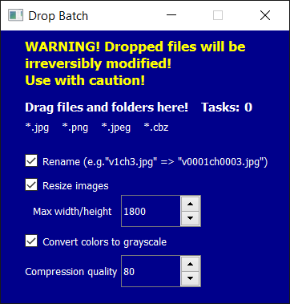

# Drop Batch
  
Drag and drop image files on app window. These files shall be processed.
### WARNING! Backup files, because they will be irreversibly modified! Use with caution!

## Features
* process files and directories dropped on app window,
* all image files inside directory and subdirectories shall be processed,
* images are going to be resized to max size: 1800x1800 (keeping aspect ratio),
* numbers in filenames will be replaced with fixed size strings, e.g. ``file 2.jpg`` => ``file 000002.jpg``,
* you may choose which processing options will be applied to your images,
* you don't need to wait until your drop ends processing, you may drop other files and directories on the same app window.

## Primary purpose
I wrote this app, because I wanted to process image files for my e-book reader.  
Reader's screen resolution is 1440x1920, so images are resized to 1800x1800 (keeping aspect ratio).  
Smaller images load faster too.  
  
Sometimes I need to process files with unsortable filenames, like ``1.jpg``, ``2.jpg``, ``3.jpg``, ..., ``10.jpg``, ``11.jpg``, ``12.jpg`` and in my e-book reader their display order is like this: ``1.jpg``, ``10.jpg``, ``11.jpg``, ``12.jpg``, ``2.jpg``, ``3.jpg``, ...  
That's why this app replaces all numbers in filenames to fixed size strings: ``000001.jpg``, ``000002.jpg``, ``000003.jpg``, ..., ``000010.jpg``, ``000011.jpg``, ``000012.jpg``.
